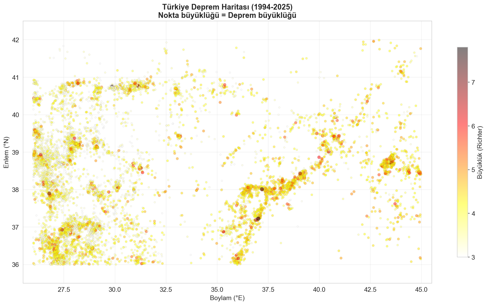
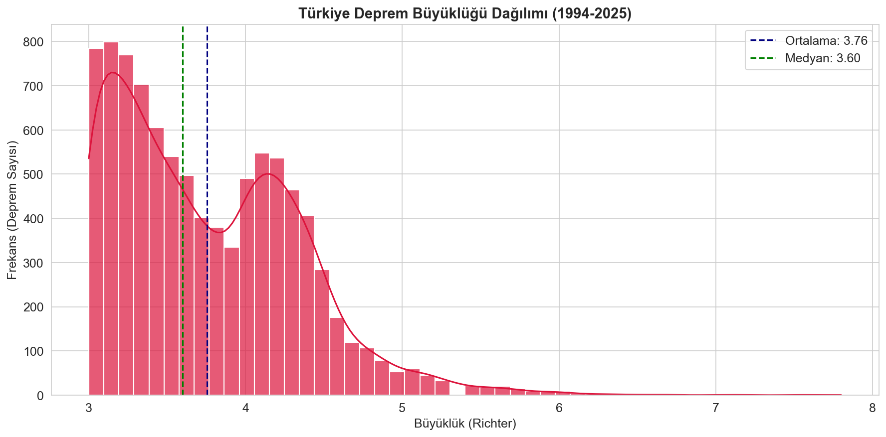
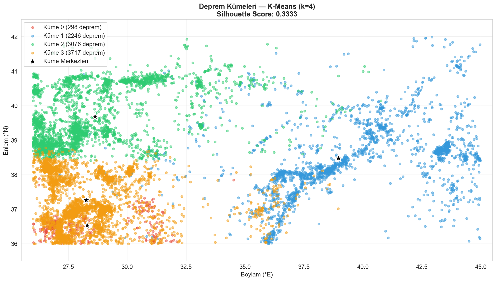
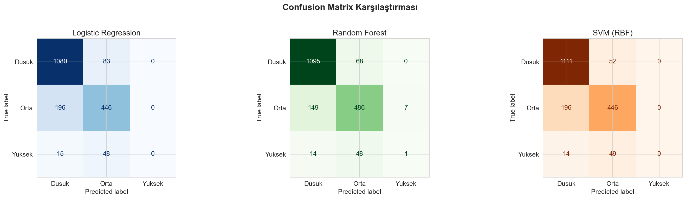
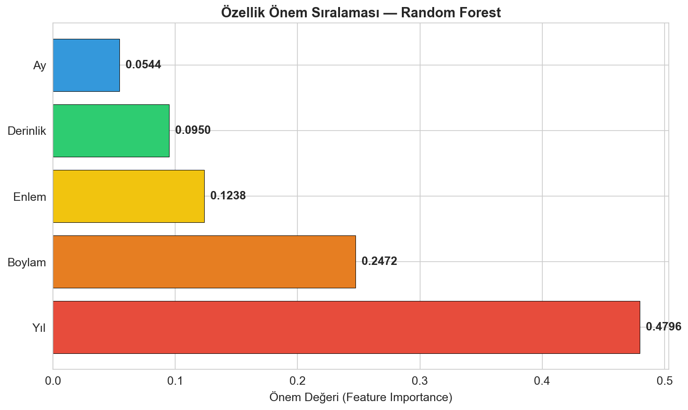

# 🌍 Türkiye Deprem Risk Analizi (1994-2025)

> Türkiye'deki 30 yıllık deprem verilerini analiz edip, bölgelere göre risk haritası çıkarma, K-Means kümeleme ve makine öğrenmesi ile risk sınıflandırma projesi.


## 📊 Proje Özeti

| Bilgi | Değer |
|-------|-------|
| **Veri Kaynağı** | USGS Earthquake API |
| **Dönem** | 1994 - 2025 |
| **Toplam Kayıt** | 9,337 deprem (Büyüklük ≥ 3.0) |
| **En Riskli Bölge** | Seferihisar (369 deprem) |
| **En İyi Model** | Random Forest (F1 = 0.83) |
| **Kümeleme** | K-Means (k=4, Silhouette = 0.33) |

## 🛠️ Kullanılan Teknolojiler

- **Veri İşleme:** Pandas, NumPy
- **Görselleştirme:** Matplotlib, Seaborn
- **İstatistik:** SciPy (Pearson Korelasyon)
- **Makine Öğrenmesi:** Scikit-Learn
  - Gözetimsiz: K-Means Kümeleme
  - Gözetimli: Logistic Regression, Random Forest, SVM

## 📈 Proje Aşamaları

### Aşama 1: Veri Toplama ve Temizleme
- USGS API'den 30 yıllık Türkiye deprem verisi çekildi
- Eksik veriler analiz edildi ve temizlendi
- Feature Engineering: Tarihten yıl, ay, saat, gün çıkarıldı
- Yer bilgisinden bölge parse edildi

### Aşama 2: Keşifsel Veri Analizi (EDA)
- Deprem büyüklüğü dağılımı (Histogram + KDE)
- Yıllara göre deprem sayısı trendi
- Derinlik-Büyüklük ilişkisi (Pearson korelasyon)
- Korelasyon matrisi (Heatmap)
- Türkiye deprem haritası (Coğrafi scatter plot)
- Bölgelere göre deprem sıralaması
- Aylık dağılım analizi (Boxplot)

### Aşama 3: Gözetimsiz Öğrenme — K-Means Kümeleme
- StandardScaler ile özellik ölçekleme
- Elbow Method ile optimal küme sayısı belirleme
- Silhouette Score ile doğrulama
- 4 küme belirlendi:
  - **Küme 0:** Ege derin depremler (ort. 110 km, büyüklük 4.1)
  - **Küme 1:** Doğu Anadolu sığ depremler (ort. 11 km, büyüklük 4.4)
  - **Küme 2:** Kuzey-Batı sığ depremler (ort. 11 km, büyüklük 3.5)
  - **Küme 3:** Güney-Batı orta depremler (ort. 17 km, büyüklük 3.5)

### Aşama 4: Gözetimli Öğrenme — Sınıflandırma
Risk seviyeleri: **Düşük** (3.0-3.9), **Orta** (4.0-4.9), **Yüksek** (5.0+)

| Model | Accuracy | F1 Score |
|-------|----------|----------|
| Logistic Regression | 0.817 | 0.800 |
| **Random Forest** | **0.847** | **0.833** |
| SVM (RBF) | 0.834 | 0.815 |

**🏆 En İyi Model: Random Forest**

## 📸 Görseller

### Türkiye Deprem Haritası


### Büyüklük Dağılımı


### K-Means Kümeleme Haritası


### Confusion Matrix Karşılaştırması


### Feature Importance


## 🚀 Kurulum ve Çalıştırma

```bash
# Repoyu klonla
git clone https://github.com/cemyildizcy/turkey-earthquake-risk-analysis.git
cd turkey-earthquake-risk-analysis

# Gerekli kütüphaneleri kur
pip install pandas numpy matplotlib seaborn scikit-learn scipy

# Projeyi çalıştır
python deprem_analiz.py
```

## 📂 Proje Yapısı

```
deprem-risk-analizi/
├── data/
│   └── turkiye_depremler.csv       # USGS deprem verisi
├── gorseller/
│   ├── 01_buyukluk_dagilimi.png
│   ├── 02_yillik_deprem.png
│   ├── 03_derinlik_buyukluk.png
│   ├── 04_korelasyon_matrisi.png
│   ├── 05_deprem_haritasi.png
│   ├── 06_bolge_deprem.png
│   ├── 07_aylik_dagilim.png
│   ├── 08_elbow_method.png
│   ├── 09_kume_haritasi.png
│   ├── 10_confusion_matrix.png
│   └── 11_feature_importance.png
├── deprem_analiz.py                # Ana proje dosyası
├── plan.md                         # Proje planı
└── README.md
```

## 🔍 Öne Çıkan Bulgular

1. **Ege Bölgesi** en çok deprem yaşayan bölge (Seferihisar, Datça, Karaburun)
2. **Derin depremler** (>100 km) genelde Ege'de yoğunlaşıyor
3. **Doğu Anadolu** depremleri daha şiddetli (ort. 4.36 büyüklük)
4. **Random Forest** en başarılı model (%84.7 doğruluk)
5. **Derinlik ve Boylam** deprem riski tahmininde en önemli özellikler

## 📝 Lisans

MIT License

## 👤 Geliştirici

**Cem Yıldız**
- GitHub: [@cemyildizcy](https://github.com/cemyildizcy)
- LinkedIn: [cemyildizcy](https://linkedin.com/in/cemyildizcy)
